# glyphfx

<p align="center">
  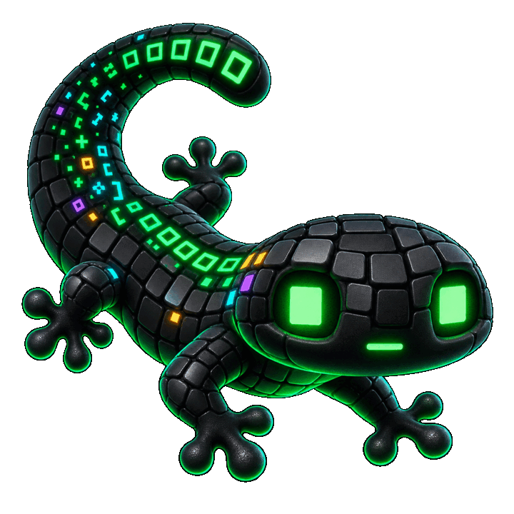
</p>

Terminal text effects as a single C17 binary. Pipe text in, pick an effect:

```sh
ls -la | glyphfx decrypt
cat banner.txt | glyphfx beams
fortune | glyphfx --random-effect
git log --oneline -10 | glyphfx matrix
```

<p align="center">
  
</p>

## Why C

The effects are a shell toy that lives in a prompt pipeline, so startup and
throughput matter. glyphfx links nothing but libc and libm — no interpreter, no
import step, no third-party libraries — and starts in well under a millisecond.

The tempting alternative is hand-written assembly. ttfx tried it: an x86-64
engine landed in [omacom/ttfx#35](https://github.com/omacom/ttfx/pull/35) and was
removed again in [7444eea](https://github.com/omacom/ttfx/commit/7444eea), once
ttfx's portable Rust engine (`fx`) matched or beat it on every effect. glyphfx
draws the same conclusion:

- **The gains are algorithmic, not instruction-level.** fx credits
  structure-of-arrays character storage, interned visuals, an incremental cell
  grid, skipped idle ticks and batched writes for its speed — all expressible in
  C. fx is glyphfx's performance target, chased by transcribing that design into
  portable C rather than re-deriving it.
- **Assembly ties the fast path to one ISA.** The ttfx assembly engine needed
  NASM and per-tier x86-64 builds; everywhere else it declined and ran the old
  code. Portable C is the same program on every CPU.
- **A byte-exact target makes a second implementation a liability.** Every
  effect must reproduce ttfx bit for bit, including banker's rounding and libm
  results; a hand-tuned assembly engine doubles the surface where the two can
  silently diverge.

> **Why not assembly?** There is no frame budget to win. glyphfx paces itself at
> 60 fps and hands one batched frame to the terminal per tick; the
> thousands-of-fps figures are a benchmark, not the product. Data layout and
> skipped work are what make the benchmark faster, and that is portable C work.

The result builds anywhere with a C compiler, starts in about 0.3 ms, and
renders every effect at thousands to tens of thousands of frames per second
with pacing disabled.

## The effects

All 37, each with a full option surface (`glyphfx <effect> --help`).

|     |     |
|:---:|:---:|
| <b>beams</b><br>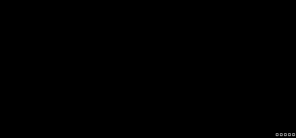<br><sub>Create beams which travel over the canvas illuminating the characters behind them.</sub> | <b>binarypath</b><br>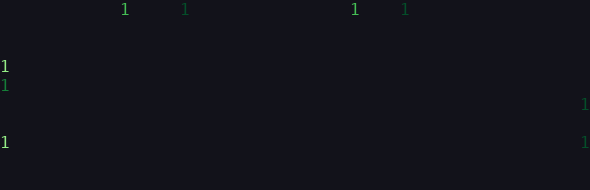<br><sub>Binary representations of each character move towards the home coordinate of the character.</sub> |
| <b>blackhole</b><br>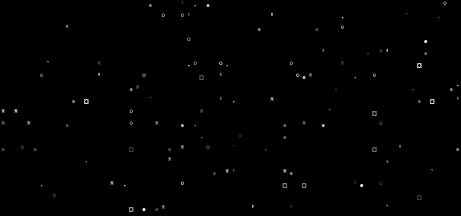<br><sub>Characters are consumed by a black hole and explode outwards.</sub> | <b>bouncyballs</b><br><br><sub>Characters are bouncy balls falling from the top of the canvas.</sub> |
| <b>bubbles</b><br><br><sub>Characters are formed into bubbles that float down and pop.</sub> | <b>burn</b><br>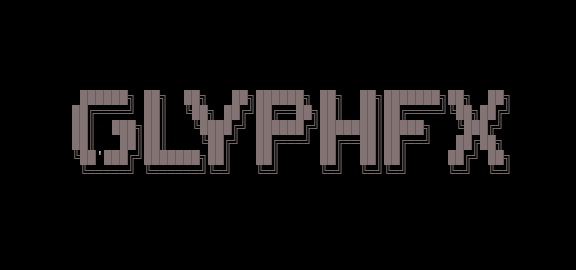<br><sub>Burns vertically in the canvas.</sub> |
| <b>colorshift</b><br>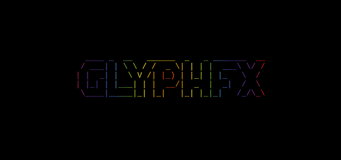<br><sub>Display a gradient that shifts colors across the terminal.</sub> | <b>crumble</b><br>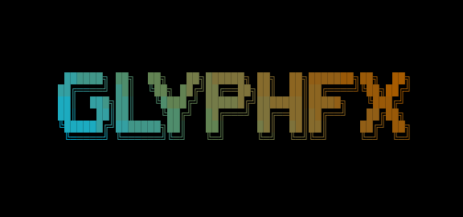<br><sub>Characters lose color and crumble into dust, vacuumed up, and reformed.</sub> |
| <b>decrypt</b><br><br><sub>Display a movie style decryption effect.</sub> | <b>errorcorrect</b><br>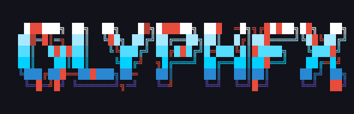<br><sub>Some characters start in the wrong position and are corrected in sequence.</sub> |
| <b>expand</b><br><br><sub>Expands the text from a single point.</sub> | <b>fireworks</b><br>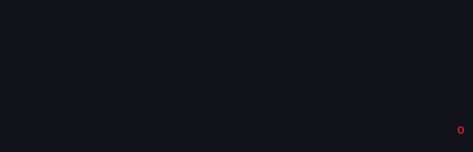<br><sub>Characters launch and explode like fireworks and fall into place.</sub> |
| <b>highlight</b><br>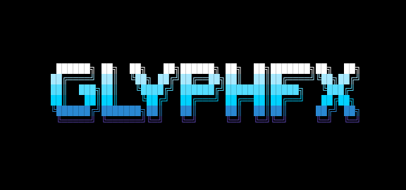<br><sub>Run a specular highlight across the text.</sub> | <b>laseretch</b><br>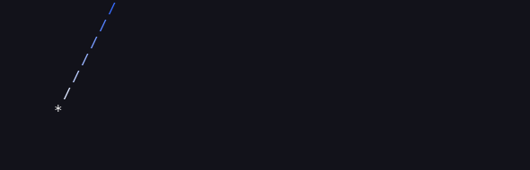<br><sub>A laser etches characters onto the terminal.</sub> |
| <b>matrix</b><br>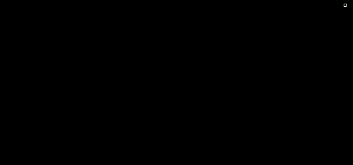<br><sub>Matrix digital rain effect.</sub> | <b>middleout</b><br><br><sub>Text expands in a single row or column in the middle of the canvas then out.</sub> |
| <b>orbittingvolley</b><br>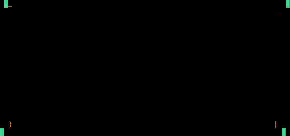<br><sub>Four launchers orbit the canvas firing volleys of characters inward to build the input text from the center out.</sub> | <b>overflow</b><br>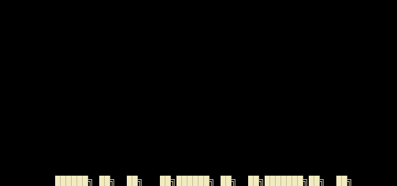<br><sub>Input text overflows and scrolls the terminal in a random order until eventually appearing ordered.</sub> |
| <b>pour</b><br>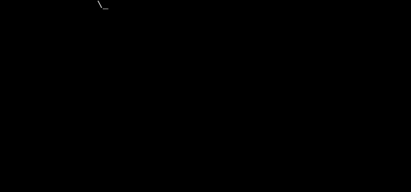<br><sub>Pours the characters into position from the given direction.</sub> | <b>print</b><br><br><sub>Lines are printed one at a time following a print head. Print head performs line feed, carriage return.</sub> |
| <b>rain</b><br>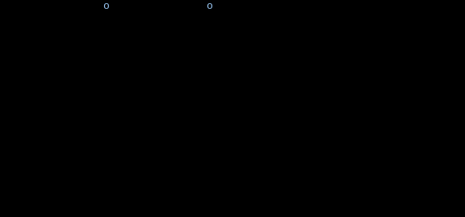<br><sub>Rain characters from the top of the canvas.</sub> | <b>randomsequence</b><br><br><sub>Prints the input data in a random sequence.</sub> |
| <b>rings</b><br>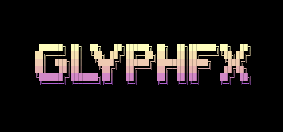<br><sub>Characters are dispersed and form into spinning rings.</sub> | <b>scattered</b><br>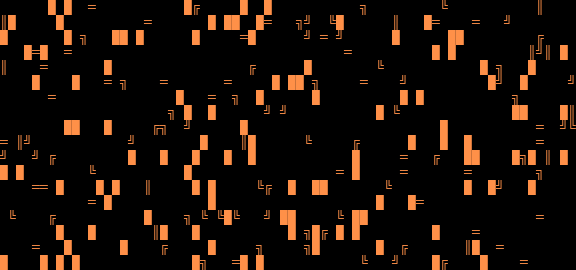<br><sub>Text is scattered across the canvas and moves into position.</sub> |
| <b>slice</b><br><br><sub>Slices the input in half and slides it into place from opposite directions.</sub> | <b>slide</b><br><br><sub>Slide characters into view from outside the terminal.</sub> |
| <b>smoke</b><br>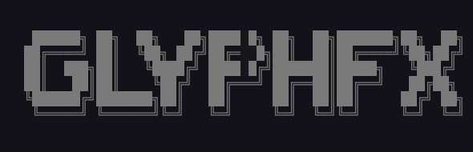<br><sub>Smoke floods the canvas colorizing any characters it crosses.</sub> | <b>spotlights</b><br>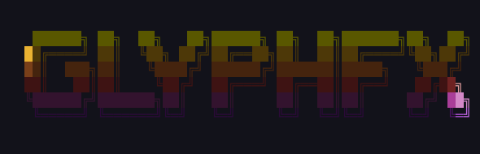<br><sub>Spotlights search the text area, illuminating characters, before converging in the center and expanding.</sub> |
| <b>spray</b><br>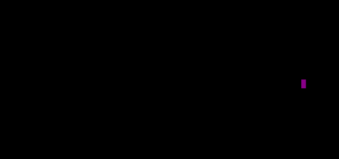<br><sub>Draws the characters spawning at varying rates from a single point.</sub> | <b>swarm</b><br>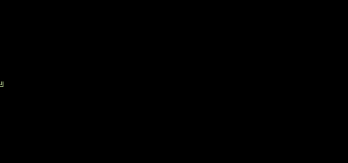<br><sub>Characters are grouped into swarms and move around the terminal before settling into position.</sub> |
| <b>sweep</b><br><br><sub>Sweep across the canvas to reveal uncolored text, reverse sweep to color the text.</sub> | <b>synthgrid</b><br>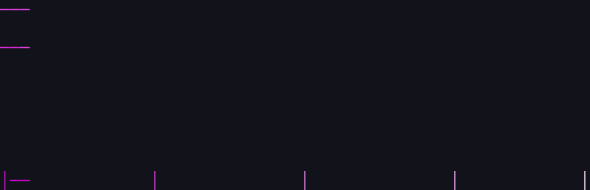<br><sub>Create a grid which fills with characters dissolving into the final text.</sub> |
| <b>thunderstorm</b><br>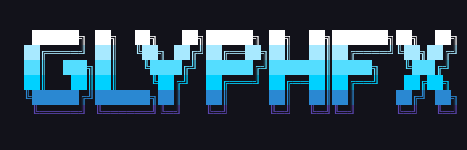<br><sub>Create a thunderstorm in the terminal.</sub> | <b>unstable</b><br>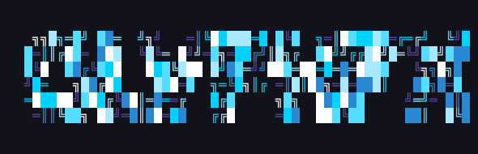<br><sub>Spawn characters jumbled, explode them to the edge of the canvas, then reassemble them in the correct layout.</sub> |
| <b>vhstape</b><br>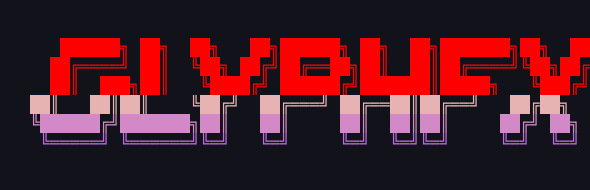<br><sub>Lines of characters glitch left and right and lose detail like an old VHS tape.</sub> | <b>waves</b><br>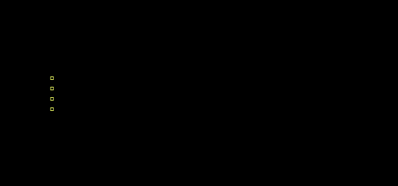<br><sub>Waves travel across the terminal leaving behind the characters.</sub> |
| <b>wipe</b><br><br><sub>Wipes the text across the terminal to reveal characters.</sub> | |

## glyphfx originals

Four effects that ttfx does not have, from the SolverForge demoscene
productions. They follow the same contract (text in, the text in place at the
end; `burnout` is the one exit effect) but sit outside byte parity:
`--random-effect` draws them only when they are named in `--include-effects`,
and `make originals` holds them to determinism, golden streams and a
final-frame check instead. Details in [docs/ORIGINALS.md](docs/ORIGINALS.md).

|     |     |
|:---:|:---:|
| <b>bannerwave</b><br><br><sub>A bright front reveals the text while every column rides a travelling sine, then the text lies flat.</sub> | <b>burnout</b><br>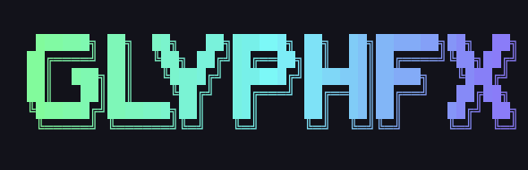<br><sub>Exit effect: the text holds, then burns away through ember colours, shades and rising sparks.</sub> |
| <b>comet</b><br><br><sub>Characters fly arcs from the bottom of the canvas on fading trails, land bright and cool into place.</sub> | <b>copper</b><br>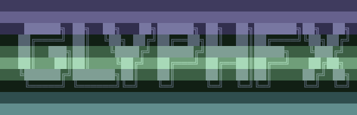<br><sub>Copper bars bounce behind dimmed text, lighting whole rows, then a sweep settles the final colours.</sub> |

## Benchmarks

Startup is under a millisecond (about 0.3 ms for `glyphfx --version`). The full
37-effect matrix against ttfx's engines: `fx`, the fastest port and glyphfx's
target; the removed assembly engine, for the record; and the Rust 0.3.3 engine
that is glyphfx's byte-parity oracle:

Best-of-N total run time at 200&times;50 with pacing disabled (`--frame-rate 0`), seed 1, on `x86_64:12th Gen Intel(R) Core(TM) i5-12400`. Speedups above 1.00&times; mean glyphfx is faster.

| effect | glyphfx | ttfx (fx) | vs fx | ttfx (asm) | vs asm | ttfx (Rust) | vs Rust |
|---|---:|---:|---:|---:|---:|---:|---:|
| beams | 126.1 ms | 26.0 ms | **0.21&times;** | 35.9 ms | **0.28&times;** | 324.8 ms | 2.58&times; |
| binarypath | 1106.2 ms | 178.9 ms | **0.16&times;** | 407.1 ms | **0.37&times;** | 1470.4 ms | 1.33&times; |
| blackhole | 480.7 ms | 106.3 ms | **0.22&times;** | 119.0 ms | **0.25&times;** | 758.7 ms | 1.58&times; |
| bouncyballs | 166.9 ms | 53.0 ms | **0.32&times;** | 64.5 ms | **0.39&times;** | 534.3 ms | 3.20&times; |
| bubbles | 261.5 ms | 79.1 ms | **0.30&times;** | 96.9 ms | **0.37&times;** | 782.5 ms | 2.99&times; |
| burn | 158.4 ms | 34.6 ms | **0.22&times;** | 51.0 ms | **0.32&times;** | 550.5 ms | 3.48&times; |
| colorshift | 280.0 ms | 41.6 ms | **0.15&times;** | 33.5 ms | **0.12&times;** | 622.3 ms | 2.22&times; |
| crumble | 285.8 ms | 85.3 ms | **0.30&times;** | 107.0 ms | **0.37&times;** | 478.2 ms | 1.67&times; |
| decrypt | 224.2 ms | 33.5 ms | **0.15&times;** | 36.1 ms | **0.16&times;** | 696.0 ms | 3.10&times; |
| errorcorrect | 83.0 ms | 32.6 ms | **0.39&times;** | 40.7 ms | **0.49&times;** | 535.5 ms | 6.45&times; |
| expand | 157.1 ms | 46.8 ms | **0.30&times;** | 42.0 ms | **0.27&times;** | 200.2 ms | 1.27&times; |
| fireworks | 393.7 ms | 112.8 ms | **0.29&times;** | 133.6 ms | **0.34&times;** | 586.7 ms | 1.49&times; |
| highlight | 28.5 ms | 7.0 ms | **0.25&times;** | 6.2 ms | **0.22&times;** | 69.1 ms | 2.42&times; |
| laseretch | 241.3 ms | 82.9 ms | **0.34&times;** | 105.6 ms | **0.44&times;** | 901.0 ms | 3.73&times; |
| matrix | 112.0 ms | 51.8 ms | **0.46&times;** | 56.4 ms | **0.50&times;** | 255.4 ms | 2.28&times; |
| middleout | 108.6 ms | 18.8 ms | **0.17&times;** | 21.2 ms | **0.20&times;** | 135.9 ms | 1.25&times; |
| orbittingvolley | 78.0 ms | 28.8 ms | **0.37&times;** | 33.2 ms | **0.43&times;** | 105.2 ms | 1.35&times; |
| overflow | 132.0 ms | 25.6 ms | **0.19&times;** | 23.5 ms | **0.18&times;** | 162.5 ms | 1.23&times; |
| pour | 94.2 ms | 33.8 ms | **0.36&times;** | 38.6 ms | **0.41&times;** | 396.3 ms | 4.21&times; |
| print | 77.7 ms | 14.7 ms | **0.19&times;** | 13.8 ms | **0.18&times;** | 555.4 ms | 7.15&times; |
| rain | 128.0 ms | 37.6 ms | **0.29&times;** | 50.9 ms | **0.40&times;** | 299.1 ms | 2.34&times; |
| randomsequence | 39.5 ms | 7.2 ms | **0.18&times;** | 7.4 ms | **0.19&times;** | 74.6 ms | 1.89&times; |
| rings | 994.0 ms | 165.3 ms | **0.17&times;** | 207.0 ms | **0.21&times;** | 888.2 ms | 0.89&times; |
| scattered | 148.8 ms | 44.8 ms | **0.30&times;** | 49.8 ms | **0.33&times;** | 236.5 ms | 1.59&times; |
| slice | 88.9 ms | 17.4 ms | **0.20&times;** | 19.2 ms | **0.22&times;** | 103.7 ms | 1.17&times; |
| slide | 81.2 ms | 28.1 ms | **0.35&times;** | 28.8 ms | **0.35&times;** | 125.7 ms | 1.55&times; |
| smoke | 93.7 ms | 16.0 ms | **0.17&times;** | 19.2 ms | **0.20&times;** | 274.9 ms | 2.93&times; |
| spotlights | 270.2 ms | 54.2 ms | **0.20&times;** | 57.9 ms | **0.21&times;** | 420.0 ms | 1.55&times; |
| spray | 143.2 ms | 50.1 ms | **0.35&times;** | 55.4 ms | **0.39&times;** | 207.9 ms | 1.45&times; |
| swarm | 804.0 ms | 178.7 ms | **0.22&times;** | 208.4 ms | **0.26&times;** | 1032.8 ms | 1.28&times; |
| sweep | 41.9 ms | 9.3 ms | **0.22&times;** | 9.8 ms | **0.23&times;** | 100.7 ms | 2.40&times; |
| synthgrid | 56.7 ms | 12.7 ms | **0.22&times;** | 12.0 ms | **0.21&times;** | 168.8 ms | 2.98&times; |
| thunderstorm | 220.9 ms | 28.1 ms | **0.13&times;** | 36.1 ms | **0.16&times;** | 513.1 ms | 2.32&times; |
| unstable | 239.5 ms | 53.5 ms | **0.22&times;** | 62.1 ms | **0.26&times;** | 303.0 ms | 1.27&times; |
| vhstape | 293.8 ms | 49.2 ms | **0.17&times;** | 62.4 ms | **0.21&times;** | 533.9 ms | 1.82&times; |
| waves | 349.4 ms | 31.0 ms | **0.09&times;** | 37.6 ms | **0.11&times;** | 909.5 ms | 2.60&times; |
| wipe | 33.1 ms | 7.2 ms | **0.22&times;** | 6.9 ms | **0.21&times;** | 71.9 ms | 2.17&times; |

Reproduce with `python3 tools/tests/matrix.py` (`GLYPHFX_TTFX_FX` names a ttfx >= 0.5 binary for the fx column, `GLYPHFX_TTFX_ASM` a build of ttfx 73c7a44 for the asm column), and `make perf` to gate against regression.

## Usage

```
<producer> | glyphfx [terminal options] <effect> [effect options]

glyphfx --help                 # the 37 effects, the 4 originals, and the terminal options
glyphfx <effect> --help        # options for one effect
glyphfx --random-effect        # surprise me (--include-effects / --exclude-effects to filter)
glyphfx --print-completion bash|zsh
```

Terminal options (canvas size and anchoring, color handling, frame rate, text
wrapping) go before the effect name; effect options after it. Option names,
defaults, metavars, choices, negative-value handling, and nargs match ttfx, so
existing invocations work with the binary name swapped.

## Building

libc and libm only.

```sh
make            # build/glyphfx
make check      # unit tests (pure-function, geometry, gradient, RNG goldens)
make debug      # ASan/UBSan build
make install    # PREFIX=/usr/local by default
make static     # static link (build/glyphfx-static)
```

## Fidelity

Given the same input, options, and seed, glyphfx produces byte-identical frames
and a byte-identical terminal stream to ttfx, verified mechanically against the
ttfx binary rather than by eye:

```sh
make parity     # M0 input/canvas/anchoring option matrix
make effects    # every effect's frame stream across seeds and configs
tools/tests/cli_corpus.sh    # exit codes and stdout/stderr routing
tools/tests/tty_compare.py   # the full pty prep+frames+teardown stream
tools/tests/tty_signals.py   # SIGINT/SIGTERM/close/resize behavior
```

The four originals have no oracle to match; `make originals` checks that they
are deterministic, match their recorded golden streams, and end on the right
final frame.

The oracle is a local ttfx checkout, fetched on demand and gitignored:

```sh
tools/parity/fetch_reference.sh
```

`make effects` expects `reference/target/release/ttfx` unless `GLYPHFX_TTFX` is
set. A single effect runs with `tools/parity/run_effects.sh <effect>`.

## Scope

Linux and macOS. Byte-exact comparison is pinned to Linux/glibc; builds and the
unit tests also run on macOS.

## Project facts

`repo_facts.db` is a [nisaba](https://github.com/blackopsrepl/nisaba) store: an
append-only, temporal key-value log of this project's decisions, benchmarks,
releases and verification results, committed on purpose so the claims in this
repository carry provenance rather than living in chat. Read it with the
`nisaba` CLI:

```sh
nisaba repo_facts.db canon project.release.latest    # current value of one key
nisaba repo_facts.db scan perf                        # everything under a prefix
nisaba repo_facts.db history perf.milestone.v1_0_0    # how a claim changed
```

The log is the source of truth; `repo_facts.db.idx`, if present, is a disposable
index cache and is not committed.

## Credit

glyphfx is a C port of [ttfx](https://github.com/omacom/ttfx), which is a Rust
port of [TerminalTextEffects](https://github.com/ChrisBuilds/terminaltexteffects)
by ChrisBuilds. The effect set, the animation engine, and the command-line
interface are TerminalTextEffects' design; ttfx is the reference glyphfx
matches byte for byte.

## License

MIT. See [LICENSE](LICENSE); attribution is in [NOTICE](NOTICE).
